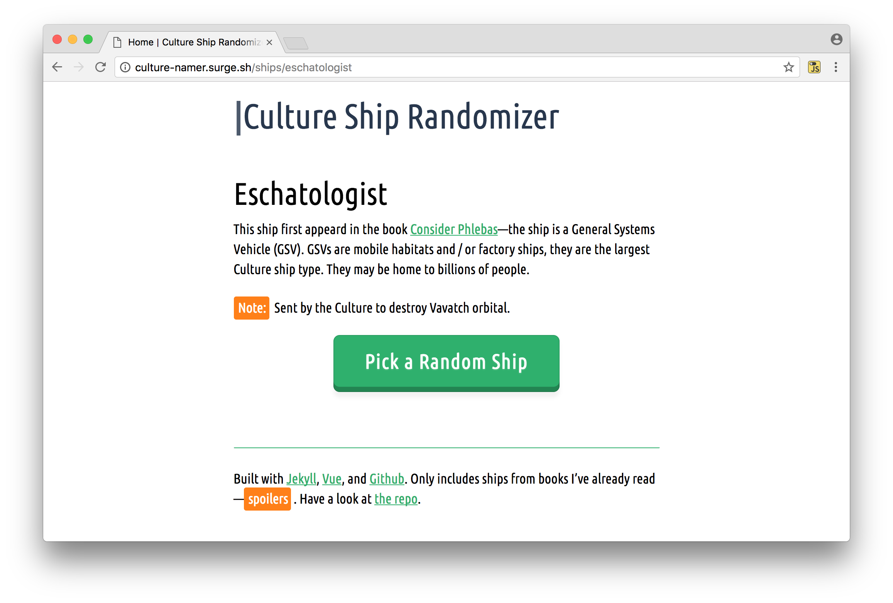

# Culture Ship Randomizer

## Pick a Culture ship at random

I often use [Culture](http://en.wikipedia.org/wiki/Culture_series") ship names when having to identify random electronic / digital bits at work or home—iPhones, servers, databases, directories, sometimes even methods or functions. 

This site makes picking a name at random a little bit easier, and a little more fun. It was also an excuse to teach myself how to use [Jekyll](http://jekyllrb.com) with [Vue](vuejs.org) to create an [isomorphicish](http://distresssignal.org/vue-and-jekyll) type site that uses the same data to render views for both the server and the client as appropriate (wheter JS is enabled or not). Enjoy.

Note: This site also builds a simple [ruby script](https://culture-namer.surge.sh/gravitas.rb) to randomly pick ship names from the command line.

