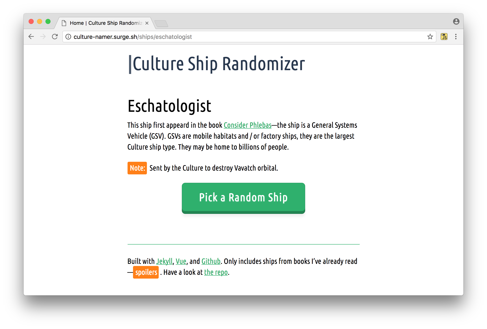

# Culture Ship Randomizer

## Pick a Culture ship at random

I often use [Culture](http://en.wikipedia.org/wiki/Culture_series") ship names when having to identify random electronic / digital bits at work or home—iPhones, servers, databases, directories, sometimes even methods or functions. 

This site makes picking a name at random a little bit easier, and a little more fun. It was also an excuse to teach myself how [Jekyll](http://jekyllrb.com) uses collections and data files. Enjoy.

Note: This site also builds a simple [ruby script](http://bryanschuetz.github.io/culture-namer/gravitas.rb) to randomly pick ship names from the command line.

